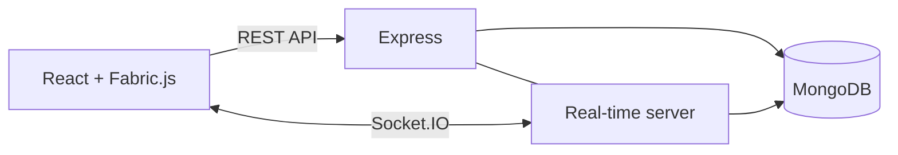

# Whiteboard Canvas

A full-stack collaborative whiteboard built with React, Fabric.js, Express, Socket.IO, and MongoDB. Users can create rooms, invite guests, and edit the same canvas together in real time.

[Live application](https://whiteboard-canvas.pages.dev) | [API health check](https://whiteboard-canvas-8lop.onrender.com/health)

## Features

- Real-time drawing and object synchronization with Socket.IO.
- Pencil, eraser, rectangle, circle, line, and text tools.
- Adjustable drawing color and stroke width.
- Move, resize, edit, and delete canvas objects.
- Member registration and login with JWT authentication.
- Guest access without requiring an account.
- Optional password protection for rooms.
- Persistent whiteboard state with MongoDB.
- Import editable whiteboards from JSON.
- Export boards as JSON, PNG, or SVG.
- Responsive canvas and connection-status feedback.

## How It Works

1. A registered member creates an open or password-protected room.
2. Other users join using the room ID as a member or temporary guest.
3. Canvas changes are serialized into object-level Socket.IO events.
4. The backend validates and stores each change in MongoDB.
5. Accepted changes are broadcast to the other participants immediately.
6. New participants receive the current persisted board state when joining.

## Technology Stack

| Area | Technology |
| --- | --- |
| Frontend | React 19, Vite, React Router |
| State management | Redux Toolkit |
| Canvas | Fabric.js |
| API client | Axios |
| Backend | Node.js, Express 5 |
| Real-time communication | Socket.IO |
| Database | MongoDB, Mongoose |
| Authentication | JWT, bcrypt |
| Testing | Vitest |
| Local deployment | Docker Compose, Nginx |
| Production | Cloudflare Pages, Render, MongoDB Atlas |

## Architecture



The backend separates transport, business logic, and persistence into controllers, services, and repositories. REST handles authentication, rooms, and import/export, while Socket.IO handles latency-sensitive canvas changes.

## Run Locally with Docker

### Requirements

- Git
- Docker Desktop

Clone the repository:

```bash
git clone https://github.com/merdeput/whiteboard-canvas.git
cd whiteboard-canvas
```

Create the root environment file:

```bash
cp .env.example .env
```

Windows PowerShell:

```powershell
Copy-Item .env.example .env
```

Set a secure local secret in `.env`:

```env
JWT_SECRET=replace-with-a-long-random-local-secret
JWT_EXPIRES_IN=7d
MONGO_DATABASE=whiteboard_canvas
CLIENT_HOST_PORT=8080
SERVER_HOST_PORT=3001
```

Start the complete stack:

```bash
docker compose up --build
```

Open [http://localhost:8080](http://localhost:8080).

Stop the application:

```bash
docker compose down
```

To also delete local MongoDB data:

```bash
docker compose down -v
```

## Run Locally for Development

Requirements: Node.js 22+, npm, and a running MongoDB instance.

Create `server/.env`:

```env
PORT=3001
NODE_ENV=development
CLIENT_ORIGIN=http://localhost:5173
JWT_SECRET=replace-with-a-long-random-development-secret
JWT_EXPIRES_IN=7d
MONGODB_URI=mongodb://127.0.0.1:27017/whiteboard_canvas
```

Start the backend:

```bash
cd server
npm install
npm run dev
```

Create `client/.env`:

```env
VITE_API_URL=http://localhost:3001/api
VITE_SERVER_URL=http://localhost:3001
```

Start the frontend in another terminal:

```bash
cd client
npm install
npm run dev
```

Open `http://localhost:5173`.

## Use the Local Frontend with Render

Set `client/.env` to the deployed backend:

```env
VITE_API_URL=https://whiteboard-canvas-8lop.onrender.com/api
VITE_SERVER_URL=https://whiteboard-canvas-8lop.onrender.com
```

Render must allow the local frontend origin:

```env
CLIENT_ORIGIN=https://whiteboard-canvas.pages.dev,http://localhost:5173
```

Restart Vite after changing `VITE_*` variables.

## Production Deployment

### Backend: Render

Create a Docker Web Service with `server` as the root directory and `/health` as the health-check path.

Configure these environment variables in Render:

```env
NODE_ENV=production
PORT=3001
CLIENT_ORIGIN=https://<your-project>.pages.dev
JWT_SECRET=<long-random-production-secret>
JWT_EXPIRES_IN=7d
MONGODB_URI=<mongodb-atlas-connection-string>
```

The `CLIENT_ORIGIN` value must exactly match the frontend origin. Multiple origins can be separated with commas.

### Frontend: Cloudflare Pages

Use these build settings:

| Setting | Value |
| --- | --- |
| Root directory | `client` |
| Build command | `npm run build` |
| Output directory | `dist` |
| Node.js version | 22 |

Configure:

```env
VITE_API_URL=https://<your-render-service>.onrender.com/api
VITE_SERVER_URL=https://<your-render-service>.onrender.com
```

After Cloudflare assigns the frontend URL, add it to Render's `CLIENT_ORIGIN` and redeploy the backend.

## Environment Variables

| Variable | Used by | Purpose |
| --- | --- | --- |
| `MONGODB_URI` | Server | MongoDB connection string |
| `JWT_SECRET` | Server | JWT signing secret |
| `JWT_EXPIRES_IN` | Server | Member token lifetime |
| `CLIENT_ORIGIN` | Server | Allowed frontend origins |
| `VITE_API_URL` | Client | REST API base URL |
| `VITE_SERVER_URL` | Client | Socket.IO server URL |

Production secrets must be configured on the hosting platform and should never be committed.

## Testing

Run the backend service, repository, and socket tests:

```bash
npm install
npm test
```

Check and build the frontend:

```bash
cd client
npm run lint
npm run build
```

## Project Structure

```text
client/     React, Redux, Fabric.js and Socket.IO client
server/     Express, Socket.IO, authentication and MongoDB persistence
tests/      Service, repository and socket tests
docker-compose.yml
```

## Current Limitation

Rooms are session-based. When the last participant disconnects, the backend removes the room and its whiteboard data. Horizontal Socket.IO scaling would also require a shared adapter such as Redis.

<!-- ## CV Summary

> Built and deployed a full-stack real-time collaborative whiteboard using React, Fabric.js, Redux Toolkit, Express, Socket.IO, MongoDB, JWT, and Docker. Implemented member and guest authentication, password-protected rooms, object-level synchronization, persistent canvas state, JSON import/export, PNG/SVG rendering, and automated service and socket tests. -->

## License

Licensed under the [MIT License](LICENSE).
